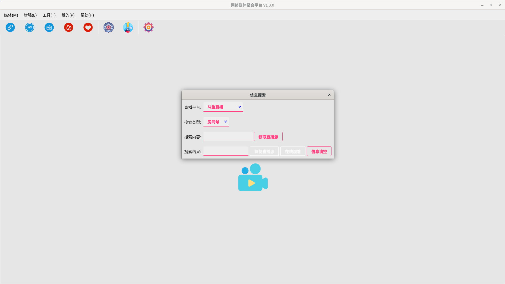
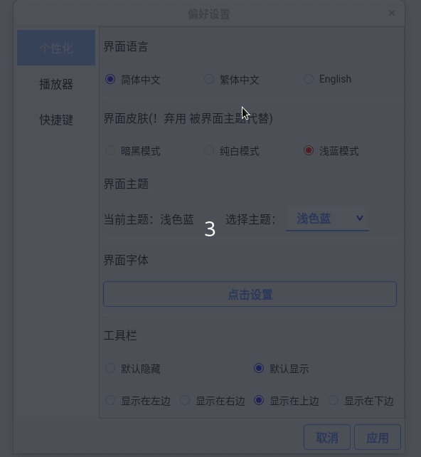
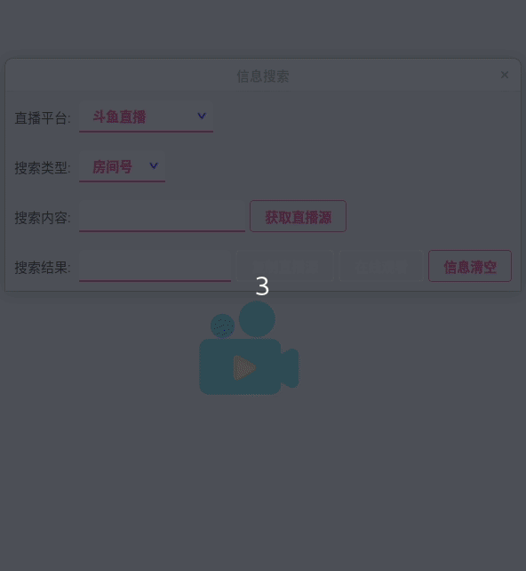
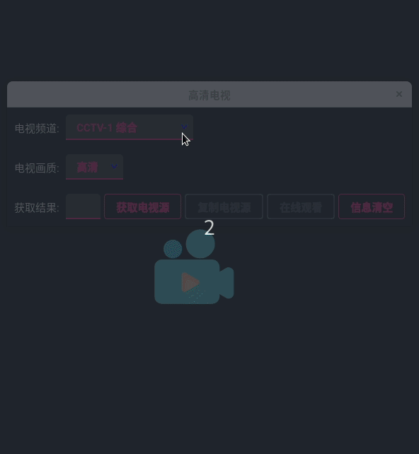
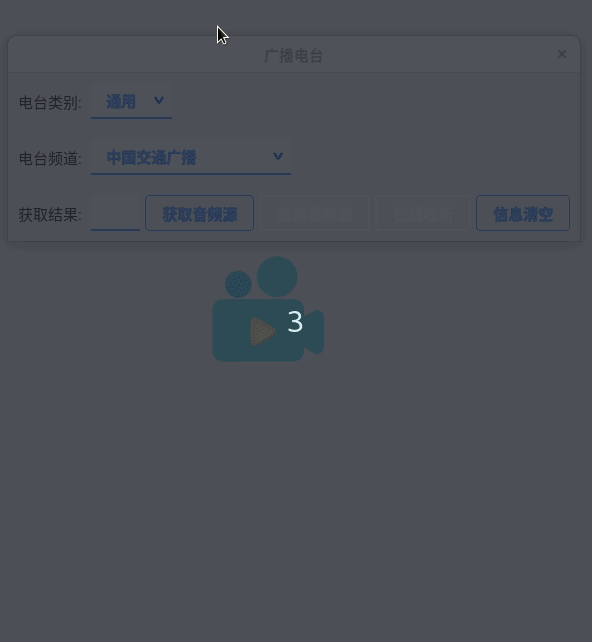
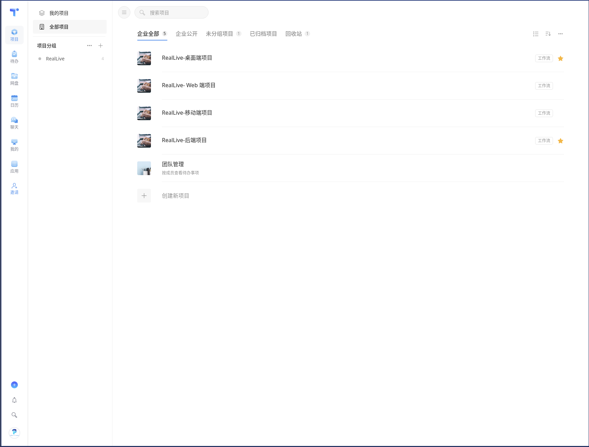
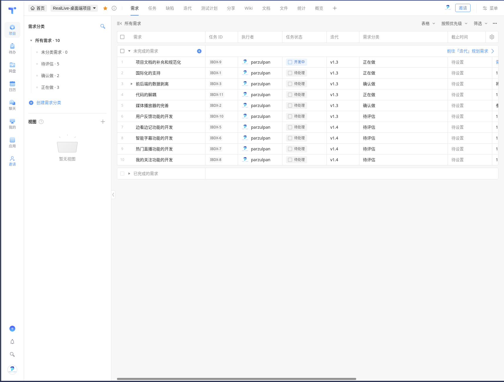
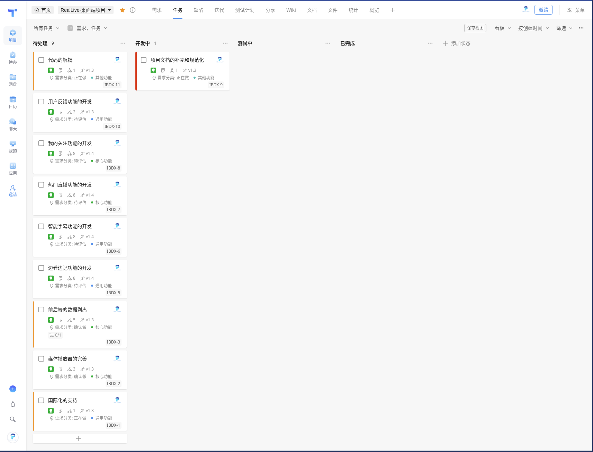
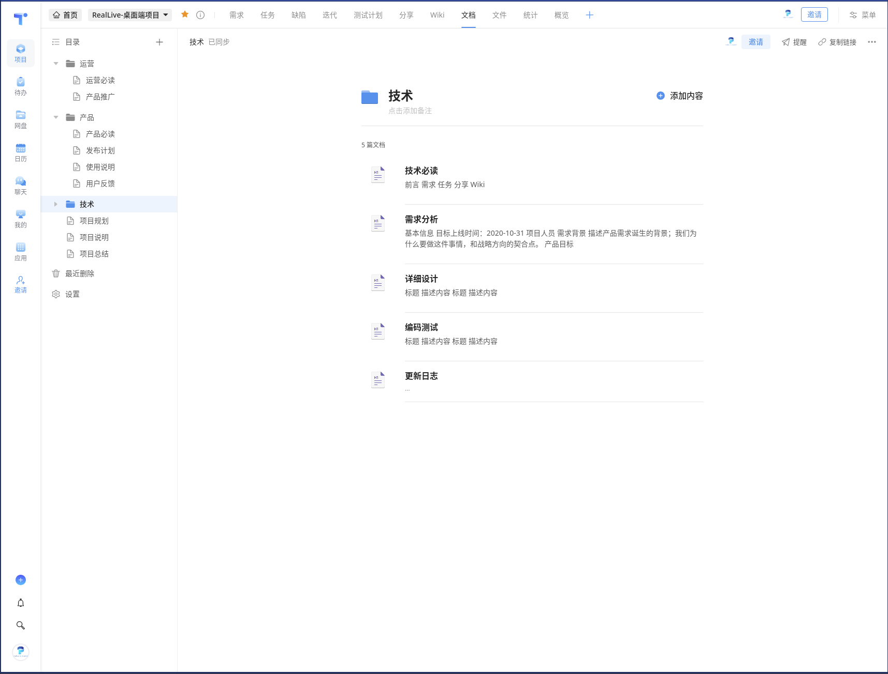

<h1 align="center">RealLive</h1>

繁體中文  |  [簡體中文](README.md)  |  [English](README-en.md)

> 一個跨平台的網絡媒體聚合應用，支持直播視頻，高清電視和廣播電台的在線觀看或收聽。

**桌面端：**

[使用視頻](./assets/desktop/Use.mp4)



| | | |
| --- | --- | --- |
|  |  |  |
|  |  |  |

## 為什麼是它

**它解決了什麼？**

* 懷念電視和電台嗎？它就能滿足你；
* 多種資源設置攜帶？它讓你隨時隨地看；
* 多個平台往返切換？它即能支持多個平台和頻道。

**它有什麼特性？**

* 多端支持，包括 Linux、MacOS、Windows 等桌面端，Android、iOS 等移動端，Web 端，後端等；
* 多平台和頻道支持，只要能得到流媒體的數據均可以觀看或收聽，不斷拓展更新中；
* 支持查看熱門直播、數據備份和恢復、筆記功能和各種偏好設置；

**它未來會如何？**

* 打通各端數據，支持數據緩存和搜索引擎；
* 持續更新各種平台或平台；
* 支持機器翻譯和智能字幕；
* 更多功能和特性等待發掘。

## 快速開始

**分支說明：**

* **master** 為保留分支
* **stable** 為 Release 發布分支
* **dev** 為一直開發的分支，歡迎大家 Fork 該分支

**桌面端調試運行：**

1. 配置好 Python 開發環境，推薦 Python3.6+。

2. Fork 後Clone 該項目，進入src/real-live-desktop 桌面端項目文件夾，配置[DebugRun.sh](./src/real-live-desktop/DebugRun.sh)後，然後運行`DebugRun. sh`。

    ```shell
    ./DebugRun.sh
    ```

**桌面端打包發布：**

1. 確保項目能運行成功後，配置 [ReleaseBuild.sh](./src/real-live-desktop/ReleaseBuild.sh)後，然後運行 `ReleaseBuild.sh`。

    ```shell
    ./ReleaseBuild.sh
    ```

[詳細可查看項目網站](https://real-live.parzulpan.cn)

## 加入項目

該項目目前桌面端基本已經完成，後端正在開發，移動端和 Web 待開發。這個項目將長期開發維護，歡迎大家參與進來，做些貢獻，或者提點建議。

**項目規劃：**

| | |
| --- | --- |
|  |  |
|  |  |

**你的收穫：**

* 正如項目規劃所示，你將體驗到真實的團隊協作方式和項目開發流程；
* 增強自己的硬實力，學習更多的技術，不管是前端還是後端，甚至是測試；
* 增強自己的軟實力，開源精神、協調溝通能力、項目推動能力、執行力等都將得到提升。

**反饋渠道：**

持續更新中，有任何疑問和建議，歡迎加入Telegram [RealLive Discussion Group](t.me/GitHubRealLive) 討論，或者提[issue](https://github.com/parzulpan/real-live/issues) 。

## 開源協議

本項目遵循 [GNU General Public License v3.0](./LICENSE)，如果要修改源碼進行二次開發需要遵守以下協議：

1. 如果要在網絡上分發，那麼必須開源；
2. 不能以盈利為目的，不能插入任何形式的廣告；
3. 註明原項目出處；
4. 繼承相同協議。

## 免責聲明

該項目僅能用於計算機技術的學習交流和在法律允許範圍內的使用，任何個人或集體不得使用該項目進行任何違反相關法律法規的活動。任何嘗試下載或下載該項目任意分支或發行版即代表您同意本項目作者及貢獻者不承擔任何由於您違反以上準則所帶來的任何法律責任。
