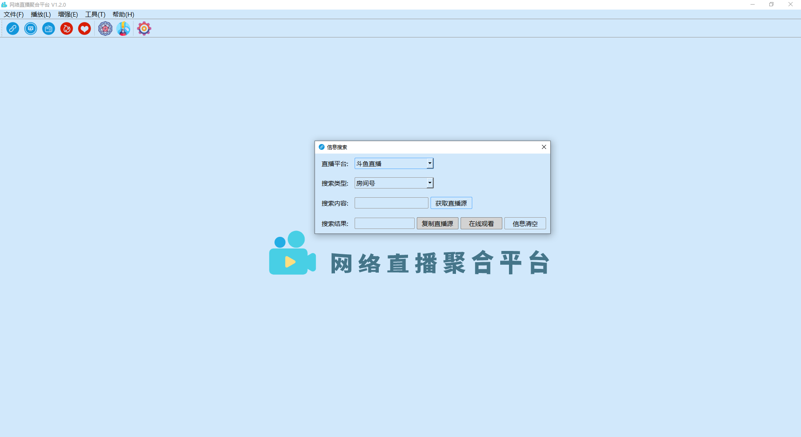

# real-live

## 简介

网络直播聚合平台的跨平台桌面端，支持视频直播、高清电视和广播电台等观看或收听。

## 支持

<details>
<summary>点我查看支持的视频直播平台</summary>

|  | | | | | | |
| --- | --- | --- | --- | --- | --- | --- |
| 斗鱼直播 | 虎牙直播 | 哔哩哔哩直播 | 企鹅电竞 | 企鹅体育 | 战旗直播 | AcFun直播 |
| 龙珠直播 | 抖音直播 | 快手直播 | 西瓜直播 | 爱奇艺直播 | 酷狗直播 | 一直播 |
| YY直播 | 映客直播 | 火猫直播 | 陌陌直播 | 京东直播 | 人人直播 | 花椒直播 |
| 触手直播 | 小米直播 | 迅雷直播 | NOW直播 | 网易CC直播 | 奇秀直播 | 六间房 |
| 17直播 | 来疯直播 | 优酷轮播台 | 网易LOOK直播 | 千帆直播 | 秀色直播 | 我秀直播 |
| 艺气山直播 |

</details>

<details>
<summary>点我查看支持的高清电视频道</summary>

|  | | | | | |
| --- | --- | --- | --- | --- | --- |
| CCTV-1 综合 | CCTV-2 财经 | CCTV-3 综艺 | CCTV-4 中文国际 | CCTV-5 体育 | CCTV-5 + |
| CCTV-6 电影 | CCTV-7 军事农业 | CCTV-8 电视剧 | CCTV-9 记录 | CCTV-10 科教 | CCTV-12 社会与法 |
| CCTV-14 少儿 | CCTV-第一剧场 | CCTV-国防军事 | CCTV-怀旧剧场 | CCTV-风云剧场 | CCTV-风云足球 |
| CCTV-风云音乐 | CCTV-世界地理 | 北京卫视 | 安徽卫视 | 重庆卫视 | 东方卫视 |
| 天津卫视 | 东南卫视 | 江西卫视 | 河北卫视 | 湖南卫视 | 湖北卫视 |
| 辽宁卫视 | 四川卫视 | 江苏卫视 | 浙江卫视 | 山东卫视 | 广东卫视 |
| 深圳卫视 | 黑龙江卫视 | NewsTV-爱情喜剧 | NewsTV-搏击 | NewsTV-潮妈辣婆 | NewsTV-动画王国 |
| NewsTV-古装剧场 | NewsTV-海外剧场 | NewsTV-家庭剧场 | NewsTV-健康有约 | NewsTV-金牌综艺 | NewsTV-惊悚悬疑 |
| NewsTV-精品大剧 | NewsTV-精品电影 | NewsTV-精品记录 | NewsTV-精品体育 | NewsTV-军旅剧场 | NewsTV-军事评论 |
| NewsTV-明星大片 | NewsTV-农业致富 | NewsTV-完美游戏 | NewsTV-中国功夫 | CHC电影 |

</details>

<details>
<summary>点我查看支持的广播电台频道</summary>

|  | | | | | |
| --- | --- | --- | --- | --- | --- |
| 中国交通广播 | 环球资讯广播 FM90.5 | 中文环球广播 | 经典音乐广播 101.8 | 哈语广播 | 藏语广播 |
| 维语广播 | 中国乡村之声 | 经济之声 | 中国之声 | 音乐之声 | 中华之声 |
| 神州之声 | 华夏之声 | 香港之声 | 文艺之声 | 老年之声 | 闽南之音 |
| 南海之声 | 客家之声 | 海峡飞虹 | 轻松调频 FM91.5 | Hit FM FM88.7 | 北京新闻广播 FM100.6 |
| 北京音乐广播 FM97.4 | 北京交通广播 FM103.9 | 北京文艺广播 FM87.6 | 北京欢乐时光 FM106.5 | 北京怀旧金曲 FM107.5 | 北京古典音乐 FM98.6 |
| 北京教学广播 FM99.4 | 北京长书广播 FM104.3 | 北京戏曲曲艺 FM105.1 | 北京房山经典音乐 FM96.9 | 北京好音乐 FM95.9 | 重庆新闻广播 FM96.8 |
| 重庆经济广播 FM101.5 | 重庆交通广播 FM95.5 | 重庆音乐广播 FM88.1 | 重庆都市广播 FM93.8 | 重庆文艺广播 FM103.5 | 巴渝之声 FM104.5 |
| 南川人民广播电台 FM107.0 | 万盛旅游交通广播 FM92.2 | 万州交通广播 | 福建新闻广播 FM103.6 | 福建经济广播 FM96.1 | 福建音乐广播 FM91.3 |
| 福建交通广播 FM100.7 | 福建东南广播 AM585 | 福建私家车广播 FM98.7 | 甘肃新闻综合广播 FM96.1 | 甘肃都市调频 FM106.6 | 甘肃交通广播 FM93.4 |
| 甘肃经济广播 FM93.4 | 甘肃农村广播 FM92.2 | 兰州新闻综合广播 FM97.3 | 兰州交通音乐广播 FM99.5 | 兰州生活文艺广播 FM100.8 | 广东新闻频道 FM91.4 |
| 广东珠江经济台 FM97.4 | 广东音乐之声 FM99.3 | 广东城市之声 FM103.6 | 广东南方生活广播 FM93.6 | 广东羊城交通广播 FM105.2 | 广东文体广播 FM107.7 |
| 广东股市广播 FM95.3 | 广东优悦广播 FM105.7 | 广州新闻电台 FM96.2 | 广州汽车音乐电台 FM102.7 | 广州交通电台 FM106.1 | 东莞音乐广播 FM104 |
| 东莞交通广播 | 当涂人民广播电台 FM90.1 |

</details>

## 架构

### 整体架构

待更新...

### 客户端架构

待更新...

[具体可查看设计说明书](./docs/设计说明书.md)

## 特色

* [x] 支持多种视频直播平台，高清电视和广播电台频道
* [x] 支持直播房间号和主播名搜索并关注
* [x] 支持在线截图、制作 gif 图、录屏等功能
* [x] 换肤设置、语言设置、字体设置等用户偏好设置功能
* [ ] 浮动笔记本功能，支持 .pdf 文件导出，.md 文件导入。
* [ ] 平台热榜查看功能，无需搜索也可观看
* [ ] 智能字幕匹配(机翻)功能
* [ ] 弹幕功能(考虑到纯净性可能不会开发)
* [ ] 自动检查更新功能

[具体可查看更新记录](./docs/更新记录.md)

## 截图

### 视频直播




### 高清电视


### 广播电台


## 快速使用

### 分支说明

**master** 为最初分支 <br/>
**stable** 为 Release 发布分支 <br/>
**dev** 为一直开发的分支，欢迎大家 Fork 该分支 <br/>

### 开发部署

1. Fork 后 Clone 该项目，进入 src 文件夹。

   ```shell
   git clone -b dev git@github.com:parzulpan/real-live.git
   cd src
   ```

2. 配置好 Python 开发环境（推荐 Python 版本为 3.6+），安装项目依赖包。

   ```shell
   pip install -r requirements.txt
   ```

3. 确认你当前使用的操作系统，如果使用的为 Windows，则将 real-live/resources/vlc_3.0.9.2_windows_64 文件夹移动到 real-live/src/resources。Linux、MacOS同理。这一步是为了使用 vlc 相关插件。

4. 运行 real-live.py。

   ```shell
   python real-live.py
   ```

### 打包发布

1. 第一次打包时，进入 src 文件夹，运行 pyinstaller，生成 real-live.spec 文件，生成 build 和 dist 文件夹。

   ```shell
   cd src
   # 参数说明：
   # -D 产生一个目录（包含多个文件）作为可执行程序
   # -w 指定程序运行时不显示命令行窗口（仅对 Windows 有效）
   # -i 程序的图标
   pyinstaller -D -w -i /home/parzulpan/Pro/real-live/src/resources/img/logo@48x48.ico real_live.py
   ```

2. 为了添加资源文件，先删除生成 build 和 dist 的文件夹。编辑 real-live.spec 文件的 datas 项目。

   ```shell
   # 参考
   # -*- mode: python ; coding: utf-8 -*-
   
   block_cipher = None
   
   
   a = Analysis(['real_live.py'],
                pathex=['/home/parzulpan/Pro/real-live/src'],	# 源码路径
                binaries=[],
                datas=[('resources', 'resources')],	# 额外添加的文件
                hiddenimports=[],
                hookspath=[],
                runtime_hooks=[],
                excludes=[],
                win_no_prefer_redirects=False,
                win_private_assemblies=False,
                cipher=block_cipher,
                noarchive=False)
   pyz = PYZ(a.pure, a.zipped_data,
                cipher=block_cipher)
   exe = EXE(pyz,
             a.scripts,
             [],
             exclude_binaries=True,
             name='real_live_v1.3.0',	# 生成的可执行文件名
             debug=False,
             bootloader_ignore_signals=False,
             strip=False,
             upx=True,
             console=False , icon='/home/parzulpan/Pro/real-live/src/resources/img/logo@48x48.ico')
   coll = COLLECT(exe,
                  a.binaries,
                  a.zipfiles,
                  a.datas,
                  strip=False,
                  upx=True,
                  upx_exclude=[],
                  name='real_live')
   ```

3. 有了第一次打包后，以后就可以直接编辑使用 real-live.spec 文件了，查看 dist 文件夹。

   ```shell
   pyinstaller real-live.spec
   ```

   

### 直接使用

客户端分为Windows、Linux、MacOS三个版本，直接到 [release](https://github.com/parzulpan/real-live/releases) 页面下载最新的版本即可。

[具体可查看使用说明书](./docs/使用说明书.md)

## 反馈

平台和频道持续更新中，有任何疑问和建议 <br/>
欢迎提 [issue](https://github.com/parzulpan/real-live/issues) <br>
或者加入 QQ 群

## 致谢

* [wbt5/real-url](https://github.com/wbt5/real-url)
* [billy21/Tvlist-awesome-m3u-m3u8](https://github.com/billy21/Tvlist-awesome-m3u-m3u8)
* [iconfont](https://www.iconfont.cn)

感谢以上开源项目和资源！

## 许可

[GPL-3.0](./LICENSE)

本项目遵循 GNU General Public License v3.0，如果要修改源码进行二次开发需要遵守以下协议：

1. 如果要在网络上分发，那么必须开源
2. 不能以盈利为目的，不能插入任何形式的广告
3. 注明原项目出处
4. 继承相同协议

## 免责

该项目仅能用于计算机技术的学习交流和在法律允许范围内的使用，任何个人或集体不得使用该项目进行任何违反相关法律法规的活动。 任何尝试下载或下载该项目任意分支或发行版即代表您同意本项目作者及贡献者不承担任何由于您违反以上准则所带来的任何法律责任。
