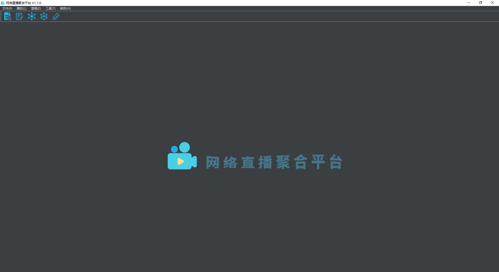
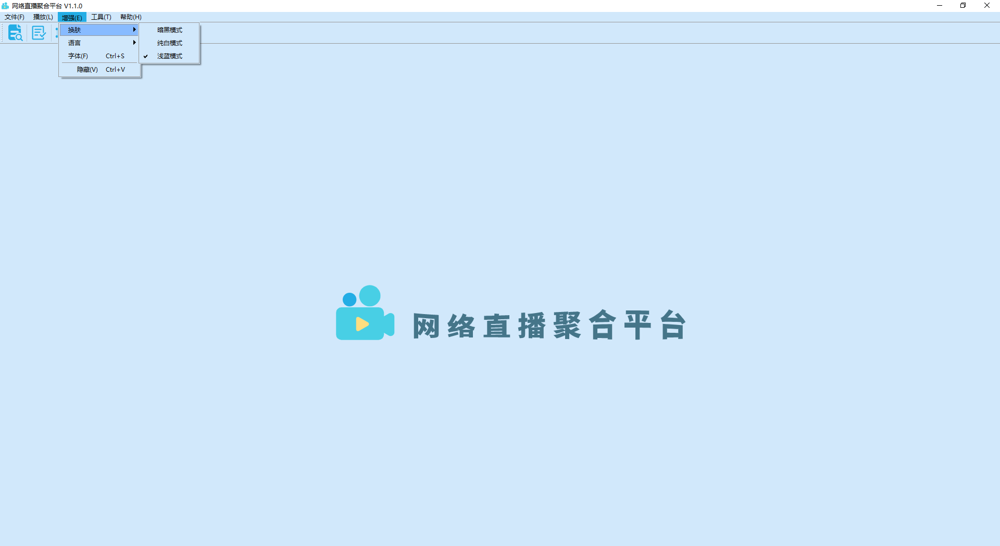
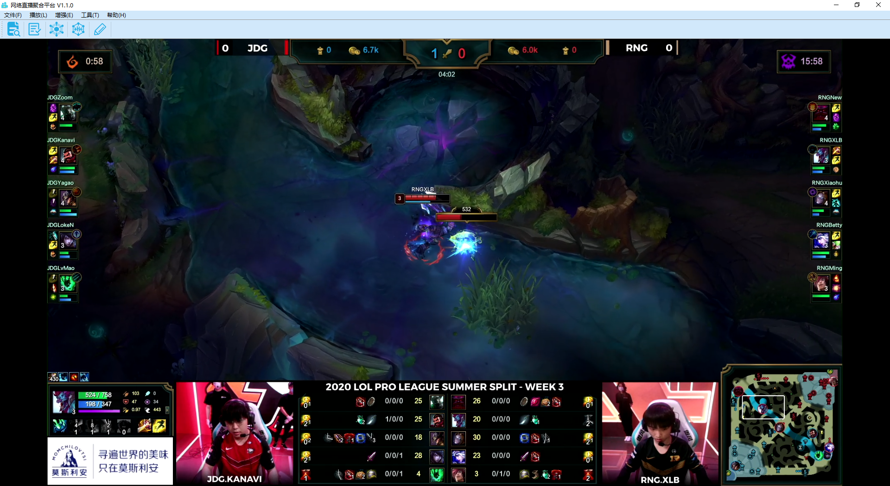
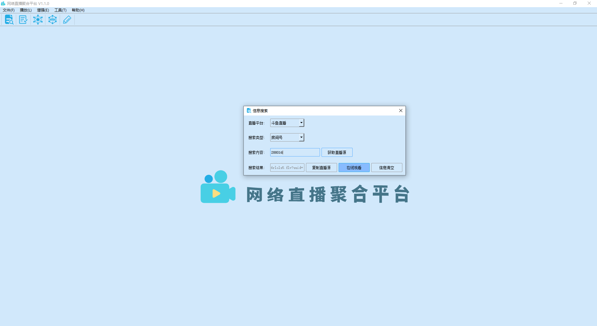

# real-live 网络直播聚合平台

## 简介
real-live是一个网络直播聚合平台，它支持当前几十种主流的直播平台，通过选择直播平台和输入查询信息即可获取相应的直播源。可以选择在本平台上在线观看，在线观看播放器分为：1. 采用FFmpeg+SDL自研的RealPlayer；2. 开源的VLC接口封装的VLCPlayer；选择一种自己喜欢的Player即可。或者将直播源复制到PotPlayer、VLC等播放器中观看。

### 架构
待更新...

### 首页

### 播放-VLC

### 搜索

## 特色
* [x] 支持多种主流直播平台，无需登录，高清晰度低延迟在线观看
* [x] 多播放器支持，包括自研的RealPlayer和封装的VLCPlayer
* [x] 支持直播房间号和主播名搜索并关注
* [ ] 平台热榜查看功能，无需搜索也可观看
* [ ] 智能字幕匹配(机翻)功能，听不懂也能看
* [x] 纯净/勿扰模式，安安静静涨姿势
* [ ] 边看边记功能，浮动笔记本，支持Markdown格式写入和PDF格式导出
* [x] 支持在线截图、制作gif图、录屏等功能，让你不错过每个经常瞬间
* [x] 换肤设置、语言设置、字体设置等用户偏好设置功能
* [ ] 弹幕功能(考虑到纯净性可能不会开发)
* [ ] 自动检查更新功能

## 使用
## Branch
**master**为最初分支 
**stable**为Release发布分支 
**dev**为一直开发的分支，欢迎大家克隆该分支进行开发 

### Debug
#### 编译调试
配置好Python开发环境后，点击[requirements.txt](./requirements.txt)文件安装依赖包，然后运行[real_live.py](./real_live.py)即可。

#### 打包安装
推荐使用Pyinstaller打包，NSIS制作安装包。

[配置参考文档](./docs/cmd.md)

### Release
直接到最新的 [release](https://github.com/parzulpan/real-live/releases) 页面下载即可，分为安装包版和免安装版。

## 反馈
有任何疑问和建议 
欢迎提 [issue](https://github.com/parzulpan/real-live/issues)  
或者加入Telegram群组 [RealLive讨论群](https://t.me/GitHubRealLive)

## 致谢
参考和借鉴以下开源项目和资源：
* [wbt5/real-url](https://github.com/wbt5/real-url)  ( 提供多种直播平台的真实流媒体地址/直播源接口 )
* [iconfont](https://www.iconfont.cn) ( 项目的资源文件均来自该网站 )

感谢以上开源项目和资源！

## 许可
[GPL-3.0](./LICENSE)

本项目遵循GNU General Public License v3.0，如果要修改源码进行二次开发需要遵守以下协议：
1. 如果要在网络上分发，那么必须开源
2. 不能以盈利为目的，不能插入任何形式的广告
3. 注明原项目出处
4. 继承相同协议