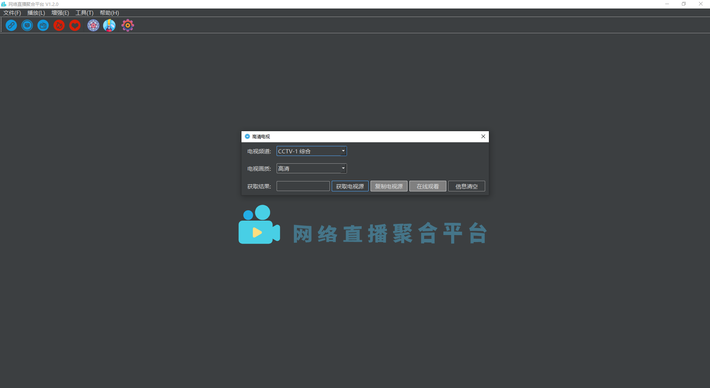
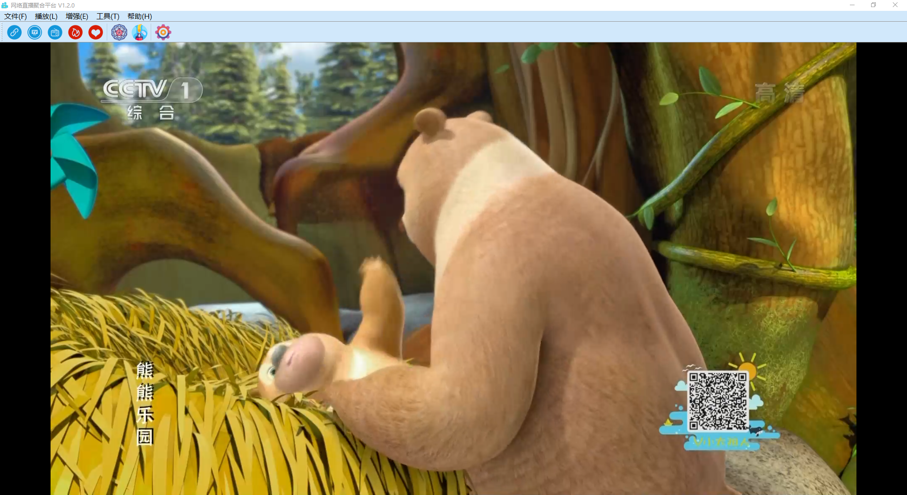
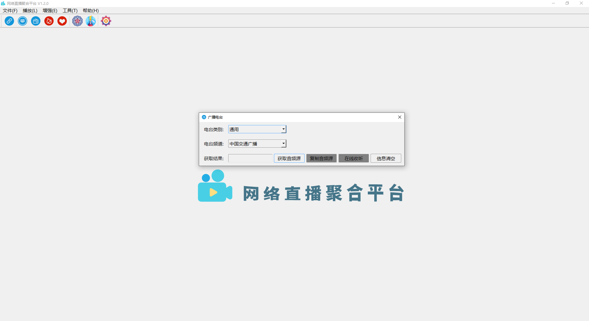
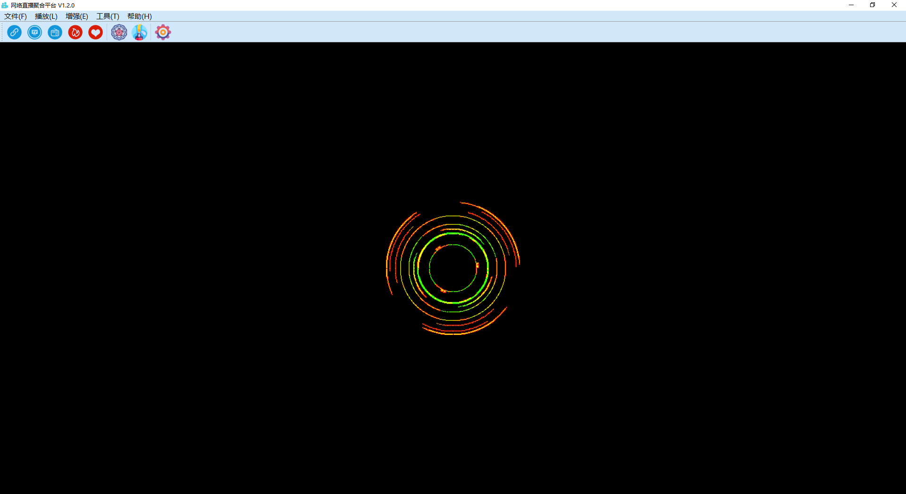

# real-live

## 项目简介

一个网络直播聚合平台，支持视频直播、高清电视和广播电台等观看或收听。包括 Linux、MacOS、Windows 等桌面端，Android、iOS 等移动端，Web 端，后端等。采用 Qt、Vue、Flutter 等主流前端技术栈，MySQL、Redis、Kafka/RabbitMQ、Elasticsearch 等主流后端技术栈。

## 支持情况

<details>
<summary>目前支持的视频直播平台：</summary>

|  | | | | | | |
| --- | --- | --- | --- | --- | --- | --- |
| 斗鱼直播 | 虎牙直播 | 哔哩哔哩直播 | 企鹅电竞 | 企鹅体育 | 战旗直播 | AcFun直播 |
| 龙珠直播 | 抖音直播 | 快手直播 | 西瓜直播 | 爱奇艺直播 | 酷狗直播 | 一直播 |
| YY直播 | 映客直播 | 火猫直播 | 陌陌直播 | 京东直播 | 人人直播 | 花椒直播 |
| 触手直播 | 小米直播 | 迅雷直播 | NOW直播 | 网易CC直播 | 奇秀直播 | 六间房 |
| 17直播 | 来疯直播 | 优酷轮播台 | 网易LOOK直播 | 千帆直播 | 秀色直播 | 我秀直播 |
| 艺气山直播 |

</details>

<details>
<summary>目前支持的高清电视频道：</summary>

|  | | | | | |
| --- | --- | --- | --- | --- | --- |
| CCTV-1 综合 | CCTV-2 财经 | CCTV-3 综艺 | CCTV-4 中文国际 | CCTV-5 体育 | CCTV-5 + |
| CCTV-6 电影 | CCTV-7 军事农业 | CCTV-8 电视剧 | CCTV-9 记录 | CCTV-10 科教 | CCTV-12 社会与法 |
| CCTV-14 少儿 | CCTV-第一剧场 | CCTV-国防军事 | CCTV-怀旧剧场 | CCTV-风云剧场 | CCTV-风云足球 |
| CCTV-风云音乐 | CCTV-世界地理 | 北京卫视 | 安徽卫视 | 重庆卫视 | 东方卫视 |
| 天津卫视 | 东南卫视 | 江西卫视 | 河北卫视 | 湖南卫视 | 湖北卫视 |
| 辽宁卫视 | 四川卫视 | 江苏卫视 | 浙江卫视 | 山东卫视 | 广东卫视 |
| 深圳卫视 | 黑龙江卫视 | NewsTV-爱情喜剧 | NewsTV-搏击 | NewsTV-潮妈辣婆 | NewsTV-动画王国 |
| NewsTV-古装剧场 | NewsTV-海外剧场 | NewsTV-家庭剧场 | NewsTV-健康有约 | NewsTV-金牌综艺 | NewsTV-惊悚悬疑 |
| NewsTV-精品大剧 | NewsTV-精品电影 | NewsTV-精品记录 | NewsTV-精品体育 | NewsTV-军旅剧场 | NewsTV-军事评论 |
| NewsTV-明星大片 | NewsTV-农业致富 | NewsTV-完美游戏 | NewsTV-中国功夫 | CHC电影 |

</details>

<details>
<summary>目前支持的广播电台频道：</summary>

|  | | | | | |
| --- | --- | --- | --- | --- | --- |
| 中国交通广播 | 环球资讯广播 FM90.5 | 中文环球广播 | 经典音乐广播 101.8 | 哈语广播 | 藏语广播 |
| 维语广播 | 中国乡村之声 | 经济之声 | 中国之声 | 音乐之声 | 中华之声 |
| 神州之声 | 华夏之声 | 香港之声 | 文艺之声 | 老年之声 | 闽南之音 |
| 南海之声 | 客家之声 | 海峡飞虹 | 轻松调频 FM91.5 | Hit FM FM88.7 | 北京新闻广播 FM100.6 |
| 北京音乐广播 FM97.4 | 北京交通广播 FM103.9 | 北京文艺广播 FM87.6 | 北京欢乐时光 FM106.5 | 北京怀旧金曲 FM107.5 | 北京古典音乐 FM98.6 |
| 北京教学广播 FM99.4 | 北京长书广播 FM104.3 | 北京戏曲曲艺 FM105.1 | 北京房山经典音乐 FM96.9 | 北京好音乐 FM95.9 | 重庆新闻广播 FM96.8 |
| 重庆经济广播 FM101.5 | 重庆交通广播 FM95.5 | 重庆音乐广播 FM88.1 | 重庆都市广播 FM93.8 | 重庆文艺广播 FM103.5 | 巴渝之声 FM104.5 |
| 南川人民广播电台 FM107.0 | 万盛旅游交通广播 FM92.2 | 万州交通广播 | 福建新闻广播 FM103.6 | 福建经济广播 FM96.1 | 福建音乐广播 FM91.3 |
| 福建交通广播 FM100.7 | 福建东南广播 AM585 | 福建私家车广播 FM98.7 | 甘肃新闻综合广播 FM96.1 | 甘肃都市调频 FM106.6 | 甘肃交通广播 FM93.4 |
| 甘肃经济广播 FM93.4 | 甘肃农村广播 FM92.2 | 兰州新闻综合广播 FM97.3 | 兰州交通音乐广播 FM99.5 | 兰州生活文艺广播 FM100.8 | 广东新闻频道 FM91.4 |
| 广东珠江经济台 FM97.4 | 广东音乐之声 FM99.3 | 广东城市之声 FM103.6 | 广东南方生活广播 FM93.6 | 广东羊城交通广播 FM105.2 | 广东文体广播 FM107.7 |
| 广东股市广播 FM95.3 | 广东优悦广播 FM105.7 | 广州新闻电台 FM96.2 | 广州汽车音乐电台 FM102.7 | 广州交通电台 FM106.1 | 东莞音乐广播 FM104 |
| 东莞交通广播 | 当涂人民广播电台 FM90.1 |

</details>

## 架构设计

整体架构待更新...

## 项目截图

### 桌面端








### 其他端

待更新...

## 快速开始

### 分支说明

* **master** 为保留分支
* **stable** 为 Release 发布分支
* **dev** 为一直开发的分支，欢迎大家 Fork 该分支

### 桌面端调试运行

1. 配置好 Python 开发环境，推荐 Python3.6+。

1. Fork 后 Clone 该项目，进入 src/real-live-desktop 桌面端项目文件夹，配置 [DebugRun.sh](./src/real-live-desktop/DebugRun.sh)后，然后运行 `DebugRun.sh`。

    ```shell
    ./DebugRun.sh
    ```

### 桌面端打包发布

1. 确保项目能运行成功后，配置 [ReleaseBuild.sh](./src/real-live-desktop/ReleaseBuild.sh)后，然后运行 `ReleaseBuild.sh`。

    ```shell
    ./ReleaseBuild.sh
    ```

[详细可查看项目网站](https://real-live.parzulpan.cn)

## 贡献致谢

### 项目反馈

持续更新中，有任何疑问和建议，欢迎加入 QQ 群 [RealLive项目讨论群：893364757](./assets/img/QQ群.jpg) 讨论，或者提 [issue](https://github.com/parzulpan/real-live/issues) 。

### 参考项目

* [wbt5/real-url](https://github.com/wbt5/real-url)
* [billy21/Tvlist-awesome-m3u-m3u8](https://github.com/billy21/Tvlist-awesome-m3u-m3u8)

### 贡献名单

| | | | |
| :--- | :--- | :--- | :--- |
| [parzulpan](https://github.com/parzulpan) | . | . | . |
| . | . | . | . |

## 项目许可

[GPL-3.0](./LICENSE)

本项目遵循 GNU General Public License v3.0，如果要修改源码进行二次开发需要遵守以下协议：

1. 如果要在网络上分发，那么必须开源
2. 不能以盈利为目的，不能插入任何形式的广告
3. 注明原项目出处
4. 继承相同协议

## 免责声明

该项目仅能用于计算机技术的学习交流和在法律允许范围内的使用，任何个人或集体不得使用该项目进行任何违反相关法律法规的活动。 任何尝试下载或下载该项目任意分支或发行版即代表您同意本项目作者及贡献者不承担任何由于您违反以上准则所带来的任何法律责任。
